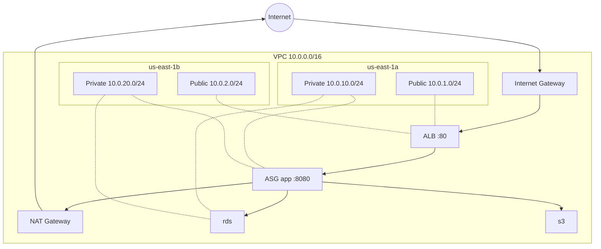

# Architecture

```mermaid
flowchart TB
    internet((Internet)) --> igw
    nat --> internet

    subgraph VPC["VPC 10.0.0.0/16"]
        igw[Internet Gateway] --> alb

        subgraph AZ-A["us-east-1a"]
            pub1["Public 10.0.1.0/24"]
            priv1["Private 10.0.10.0/24"]
        end
        subgraph AZ-B["us-east-1b"]
            pub2["Public 10.0.2.0/24"]
            priv2["Private 10.0.20.0/24"]
        end

        alb["ALB :80"] --> asg
        asg["ASG app :8080"] --> rds
        asg --> s3
        asg --> nat[NAT Gateway]
        pub1 -.- alb
        pub2 -.- alb
        priv1 -.- asg
        priv2 -.- asg
        priv1 -.- rds
        priv2 -.- rds
    end
```
